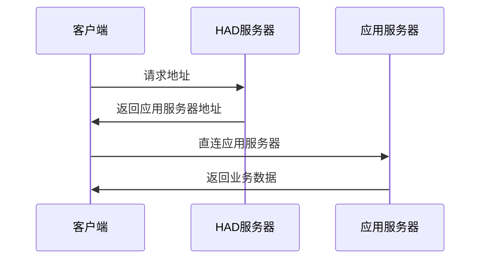

# 地址调度器 HTTP Address Dispatcher (HAD)

## 介绍

HAD 是一个轻量级的应用层负载均衡解决方案，通过多维度路由匹配和智能调度算法，解决传统DNS和CDN方案的局限性而设计。HAD通过实时健康检查和动态路由分配，实现秒级故障转移和精确的流量控制，支持多应用、多环境、多业务厂商等复杂场景，具备良好的扩展性和可维护性，是构建现代化应用架构的重要基础设施。



## 特性

- **应用层API设计** - 无需修改基础设施，比DNS灵活，比代理轻量
- **多维度条件组合** - 地理位置 + 客户端类型 + 环境 + 业务方，灵活应对复杂场景
- **秒级故障转移** - 远快于DNS的1-10分钟延迟，秒级故障切换
- **配置简洁** - 配置简单，易于部署和维护
- **客户端友好** - 详细的缓存和故障转移策略文档
- **适用性广** - 适用于各类客户端，例如浏览器、移动应用、后端服务的数据库连接、物联网设备的mqtt连接等

## 应用场景

### 1. 手动故障转移
```
服务器故障 → 运维人员部署新服务器 → 更新HAD配置端点 → 客户端自动获取新地址
无需修改客户端代码 → 无需重新发布应用 → 故障切换只需几秒
```

### 2. 自动故障转移
```
多端点配置 → 服务器故障 → HAD健康检查剔除故障端点 → 客户端检测到宕机自动获取新地址
```
该场景适用于**摆脱成本高昂的头部IDC**，相同成本可以购置10台同配置服务器分布在不同三线厂商的不同地区和线路，
可能单台服务器SLA从99.99%变成了95%，但是在自动故障转移的加持下，系统整体的可用性更高了。

### 3. 多环境API管理
```
开发环境请求 → dev.api.example.com
预发布环境请求 → pre.api.example.com
生产环境请求 → api.example.com
```

### 4. 多业务厂商差异化服务
```
A公司客户 → 高性能服务器集群
B公司客户 → 标准服务器集群
C公司客户 → 经济型服务器集群
```

### 5. 基于GeoIP路由
```
中国用户 → 国内CDN节点 → 低延迟访问
美国用户 → 美西数据中心 → 就近接入
欧洲用户 → 欧洲CDN节点 → 合规要求
```

### 6. 客户端差异化路由
```
国内客户端 → 国内服务器地址
国外客户端 → CDN地址
```

### 配置格式

每个应用（application）使用一个单独的配置文件，配置格式参考：[user-service.yaml](config/user-service.yaml)


## 名词定义

| 名词 | 位置 | 取值 | 说明 |
|------|--------|------|-----------|
| **HAD** | 应用层 | 字面量 | 本程序名称的简写形式 |
| **application** | 请求参数 | 字符串 | 应用名称，如user-service、order-service |
| **client** | 请求参数 | web/app/device | 客户端类型 |
| **environment** | 请求参数 | prod/pre/dev | 环境标识 |
| **vendor** | 请求参数 | 字符串 | 业务厂商标识，如company-a、company-b |
| **default** | 配置参数 | 对象，字符串 | 格式同endpoint，未命中条件时的默认端点 |
| **condition** | 配置参数 | 字符串 | 匹配条件，如environment=prod&vendor=company-a |
| **endpoints** | 响应参数 | 数组 | 端点列表(endpoint[])，包含权重、负载等信息 |
| **endpoint** | 响应参数 | 对象，字符串 | 端点简写模式，等同于endpoint.url，其他参数使用默认值 |
| **endpoint.name** | 响应参数 | 字符串 | 端点名称，对应配置中的key，用于健康检查查询 |
| **endpoint.url** | 响应参数 | 字符串 | 端点地址 |
| **endpoint.weight** | 响应参数 | 数字 | 端点权重，用于负载均衡，默认为10，越大越优先 |
| **endpoint.load** | 响应参数 | 数字 | 端点当前负载，0-1之间的小数，由服务器通过健康检查上报 |
| **endpoint.status** | 响应参数 | 字符串 | 端点状态，healthy/failed/unhealthy |
| **endpoint.ttl** | 响应参数 | 数字 | 端点缓存有效期，单位秒，默认为600秒（十分钟） |
| **client_info** | 响应参数 | 对象 | HAD解析的客户端信息，包括IP、地理位置等，用于客户端排查用途 |


**url**：典型场景为API请求前缀，但不要求必须是API地址或HTTP地址，它也可以是一个带认证信息的数据库连接，一个MQTT地址，一个TCP/UDP地址等

**status**：端点状态含义：
- healthy：健康，可以接受请求 
- failed：失败，可能由于超时、重试次数耗尽等原因
- unhealthy：无法确认健康状况，可能由于未配置健康检查策略等原因

**ttl**：ttl仅用于无故障时更新地址，或未配置健康检查策略时故障转移用途

## API

### 解析端点
```http
GET /api/v2/route?application={app}&client={client}&environment={env}&vendor={vendor}&ip={ip}

Response:
{
  "code": 200,
  "message": "success",
  "data": {
    "client_info": {
      "ip": "203.208.60.1",
      "country": "CN",
      "city": "Beijing",
      "isp": "China Telecom",
      "timezone": "Asia/Shanghai"
    },
    "endpoints": [
      {
        "name": "us-a-prod",
        "url": "https://api-bj1.example.com",
        "status": "healthy",
        "weight": 100,
        "load": 0.3
      },
      {
        "name": "a-prod",
        "url": "https://api-bj2.example.com",
        "weight": 80,
        "load": 0.7,
        "status": "healthy"
      }
    ]
  }
}
```

### 健康检查
```http
GET /api/v2/health?application={app}&endpoint={name}

Response:
{
  "code": 200,
  "data": {
    "endpoint_status": "healthy"
  }
}
```

## 客户端实现

### 工作原理

HAD客户端采用**DNS解析式的缓存策略**，确保在HAD不可用时仍能保持服务可用性：

| 阶段 | 操作 | 说明 |
|------|------|------|
| **1. 缓存检查** | 检查本地缓存 | 如果缓存有效（未过期），直接返回缓存数据 |
| **2. HAD请求** | 请求HAD | 缓存无效或不存在时，请求HAD获取最新地址 |
| **3. 缓存更新** | 缓存成功响应 | 将HAD响应缓存，记录TTL和时间戳 |
| **4. 故障降级** | 使用过期缓存 | HAD解析请求失败时，使用过期缓存保证可用性 |
| **5. 故障检测** | 检测端点宕机 | 业务请求失败时，判断是否为端点宕机 |
| **6. 确认宕机** | 进行端点健康检查 | 如果确认端点宕机，重新请求地址 |


### 端点宕机的判断标准

| 错误类型 | 示例 | 处理方式 |
|---------|------|---------|
| **连接拒绝** | ECONNREFUSED | 重新请求HAD |
| **连接重置** | ECONNRESET | 重新请求HAD |
| **DNS解析失败** | ENOTFOUND | 重新请求HAD |
| **连接超时** | ETIMEDOUT | 重新请求HAD |
| **HTTP 5xx** | 500/502/503 | 重新请求HAD |

**其他：** 除了上述条目，其他的情况不可认定为服务器故障，应按照业务错误处理，例如弹出错误窗口“系统正忙/密码错误/数据不存在等。。。”

### 客户端库

完整的客户端实现已提供在 [client/had-client.js](client/had-client.js)

**特性**:
- ✅ 支持浏览器和Node.js环境
- ✅ 自动HTTP适配器选择
- ✅ DNS解析式缓存策略
- ✅ 端点宕机检测
- ✅ 无依赖，可直接使用

### 浏览器使用

```html
<script src="client/had-client.js"></script>
<script>
  const client = new HADClient({
    routerBaseUrl: 'https://router.example.com',
    application: 'user-service',
    client: 'web',
    environment: 'prod'
  });

  // 获取路由
  const route = await client.getRoute();
  const endpoint = client.selectEndpoint(route.endpoints);

  // 发起请求
  const response = await fetch(endpoint.url + '/api/users');

  // 检测端点宕机
  if (response.status >= 500 || client.isServerFaultError(error)) {
    client.clearCache();  // 清除缓存
    const newRoute = await client.getRoute();  // 重新请求
  }
</script>
```

## 其他类似方案

业界常见的负载均衡和路由方案：

| 方案 | 工作层级 | 定位 | 与HAD的差异 |
|------|--------|------|-----------|
| **Polaris GSLB** | DNS层 | 全局负载均衡 | DNS级别，故障转移慢（1-10分钟） |
| **Kong/APISIX** | 应用层 | 完整API网关 | 功能复杂，需要处理所有HTTP连接 |
| **Traefik** | 应用层 | 反向代理 | 需要处理流量，不是返回地址 |
| **Envoy** | 应用层 | 代理 | 需要处理所有连接，部署复杂 |
| **Istio/Linkerd** | 基础设施 | 服务网格 | 需要Sidecar，改造基础设施 |
| **Keepalived** | 网络层 | L4负载均衡 | 网络层方案，不支持应用层条件 |
