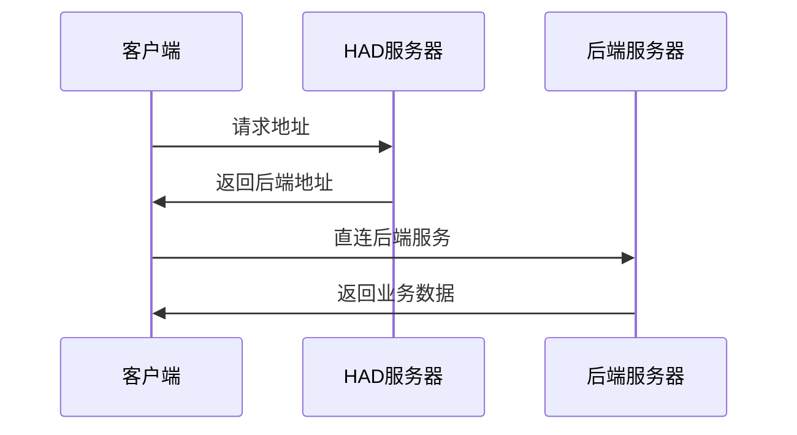

# 地址调度器 HTTP Address Dispatcher （HAD）

## 项目介绍

HAD 是一个轻量级的应用层负载均衡解决方案，通过多维度路由匹配和智能调度算法，解决传统DNS和CDN方案的局限性而设计。

传统DNS负载均衡存在故障恢复缓慢（1-10分钟延迟）和缺乏智能调度能力的问题。CDN方案虽然功能强大，但成本高昂且存在供应商锁定风险。HAD通过实时健康检查和动态路由分配，实现秒级故障转移和精确的流量控制。

系统支持从简单的故障转移到复杂的多维度路由策略，包括基于地理位置、客户端类型、环境和业务方的条件分配。通过统一的API接口，开发者可以轻松集成并根据业务需求灵活配置路由规则，实现高可用性和最优性能。

配合完善的客户端实现策略，HAD能够在各种故障场景下保持服务的连续性和用户体验的流畅性。客户端通过缓存、故障检测和重路由，实现了真正的高可用架构。

系统支持微服务、多环境、多业务厂商等复杂场景，具备良好的扩展性和可维护性，是构建现代化应用架构的重要基础设施。




## 与其他方案的对比

HAD 与业界常见的负载均衡和路由方案的对比：

| 方案 | 工作层级 | 定位 | 与HAD的差异 |
|------|--------|------|-----------|
| **Polaris GSLB** | DNS层 | 全局负载均衡 | DNS级别，故障转移慢（1-10分钟） |
| **Kong/APISIX** | 应用层 | 完整API网关 | 功能复杂，需要处理所有HTTP连接 |
| **Traefik** | 应用层 | 反向代理 | 需要处理流量，不是返回地址 |
| **Envoy** | 应用层 | 代理 | 需要处理所有连接，部署复杂 |
| **Istio/Linkerd** | 基础设施 | 服务网格 | 需要Sidecar，改造基础设施 |
| **Keepalived** | 网络层 | L4负载均衡 | 网络层方案，不支持应用层条件 |

### HAD 的独特优势

- **应用层API设计** - 比DNS灵活，比代理轻量，无需修改基础设施
- **多维度条件组合** - 地理位置 + 客户端类型 + 环境 + 业务方，灵活应对复杂场景
- **秒级故障转移** - 远快于DNS的1-10分钟延迟
- **配置简洁** - YAML配置，易于理解和维护
- **客户端友好** - 详细的缓存和故障转移策略文档，易于集成

## 应用场景

### 1. 简单快速的手动故障转移
```
服务器故障 → 运维人员更新路由配置 → 客户端自动获取新地址
无需修改客户端代码 → 无需重新发布应用 → 故障切换只需几分钟
```

### 2. 微服务路由网关
```
用户服务请求 → 路由器 → 根据负载选择用户服务实例
订单服务请求 → 路由器 → 根据地区选择订单服务集群
```

### 3. 多环境API管理
```
开发环境请求 → dev.api.example.com
预发布环境请求 → pre.api.example.com
生产环境请求 → api.example.com
```

### 4. 多业务厂商差异化服务
```
A公司客户 → 高性能服务器集群
B公司客户 → 标准服务器集群
C公司客户 → 经济型服务器集群
```

### 5. 基于GeoIP路由
```
中国用户 → 国内CDN节点 → 低延迟访问
美国用户 → 美西数据中心 → 就近接入
欧洲用户 → 欧洲CDN节点 → 合规要求
```

### 6. 客户端差异化路由
```
Web客户端 → 高性能后端集群
移动App → 移动优化后端集群
IoT设备 → 轻量级后端集群
```

## 名词定义

| 名词 | 位置 | 取值 | 说明 |
|------|--------|------|-----------|
| **HAD** | 应用层 | 路由调度器 | 应用层API，无需修改基础设施 |
| **application** | 请求参数 | 字符串 | 应用名称，如user-service、order-service |
| **client** | 请求参数 | web/app/device | 客户端类型 |
| **environment** | 请求参数 | prod/pre/dev | 环境标识 |
| **vendor** | 请求参数 | 字符串 | 业务厂商标识，如company-a、company-b |
| **default_endpoint** | 配置参数 | 字符串 | 保底地址，未命中condition时的默认路由 |
| **condition** | 配置参数 | 字符串 | 匹配条件，如environment=prod&vendor=company-a |
| **endpoints** | 响应参数 | 数组 | 端点地址列表，包含权重、负载等信息 |
| **endpoints.url** | 响应参数 | 字符串 | 端点地址 |
| **endpoints.weight** | 响应参数 | 数字 | 端点权重，用于负载均衡，默认为10，越大越优先 |
| **endpoints.load** | 响应参数 | 数字 | 端点当前负载，0-1之间的小数，由服务器通过健康检查上报 |
| **endpoints.status** | 响应参数 | 字符串 | 端点状态，healthy/failed/unhealthy |
| **client_info** | 响应参数 | 对象 | 服务器解析出的客户端信息，包括IP、地理位置等，用于客户端排查用途 |


**url**：一般用作API请求前缀，但不要求一定是API地址或http地址，它可以是一个网页地址或者一个MQTT地址或者一个TCP地址

**status**：端点状态含义：
- healthy：健康，可以接受请求 
- failed：失败，可能由于超时、重试次数耗尽等原因
- unhealthy：不健康，可能由于配置错误、权限问题等原因

## API设计

### 获取路由信息
```http
GET /api/v2/route?application={app}&client={client}&environment={env}&vendor={vendor}&ip={ip}

Response:
{
  "code": 200,
  "message": "success",
  "data": {
    "client_info": {
      "ip": "203.208.60.1",
      "country": "CN",
      "city": "Beijing",
      "isp": "China Telecom",
      "timezone": "Asia/Shanghai"
    },
    "endpoints": [
      {
        "url": "https://api-bj1.example.com",
        "status": "healthy",
      },
      {
        "url": "https://api-bj2.example.com",
        "weight": 80,
        "load": 0.7,
        "status": "healthy", 
      }
    ]
  }
}
```

### 健康检查接口
```http
GET /api/v2/health?application={app}&endpoint={name}

Response:
{
  "code": 200,
  "data": {
    "endpoint_status": "healthy"
  }
}
```

## 路由规则配置

### 漏斗形匹配机制
路由匹配采用漏斗形机制，从通用到具体逐层匹配：
1. **保底地址**: 定义默认路由，确保总有可用地址
2. **条件拦截**: 通过条件组合拦截特定请求，条件越具体优先级越高
3. **地址数组**: 每个匹配规则返回地址数组，通常包含一个地址，可配置多个

### 服务配置

每个应用（application）使用一个单独的配置文件

配置格式参考：[user-service.yaml](config/user-service.yaml)


## 客户端实现

### 缓存策略

#### 缓存原则
客户端必须缓存每一次成功的路由请求响应，包括端点数组为空的响应。这确保在路由器不可用时，客户端仍能使用最后一次获取的路由信息。

#### 缓存实现
```javascript
// JavaScript示例
class RouterClient {
  constructor() {
    this.cache = new Map();
    this.cacheKey = (app, client, env, vendor) =>
      `${app}:${client}:${env}:${vendor || 'default'}`;
  }

  async getRoute(params) {
    const key = this.cacheKey(params.application, params.client,
                             params.environment, params.vendor);

    try {
      // 请求路由器，必须实现一个快速超时，例如1000ms，
      const response = await this.fetchRoute(params);
      if (response.code === 200) {
        // 缓存成功响应，包括空端点数组
        this.cache.set(key, {
          data: response.data,
          timestamp: Date.now(),
          ttl: response.data.routing_info?.ttl || 300
        });
        return response.data;
      }
    } catch (error) {
      console.warn('路由器请求失败，使用缓存:', error.message);
    }

    // 使用缓存
    const cached = this.cache.get(key);
    if (cached) {
      return cached.data;
    }

    throw new Error('无可用路由信息');
  }
}
```

### 端点选择策略

#### 简单实现：取第一个
为降低客户端实现难度，推荐简单实现直接使用第一个端点：

```javascript
function getEndpoint(routeData) {
  const endpoints = routeData.endpoints;
  if (endpoints && endpoints.length > 0) {
    return endpoints[0].url;
  }
  return null;
}
```

#### 复杂实现：智能选择
对于需要复杂选址的客户端，可以实现负载均衡算法：

```javascript
function selectEndpoint(endpoints) {
  // 过滤健康的端点
  const healthyEndpoints = endpoints.filter(ep => ep.status === 'healthy');

  if (healthyEndpoints.length === 0) {
    return endpoints[0]?.url || null;
  }

  // 基于权重和负载的选择
  const totalWeight = healthyEndpoints.reduce((sum, ep) => {
    return sum + (ep.weight * (1 - ep.load));
  }, 0);

  let random = Math.random() * totalWeight;
  for (const endpoint of healthyEndpoints) {
    random -= endpoint.weight * (1 - endpoint.load);
    if (random <= 0) {
      return endpoint.url;
    }
  }

  return healthyEndpoints[0].url;
}
```

### 故障检查与重路由

#### 故障检测流程
当客户端请求业务接口出现特定错误时，应进行故障检查以确定是否为服务器故障：

```javascript
class ServiceClient {
  async request(url, options) {
    try {
      const response = await fetch(url, options);

      // 检查5xx服务器错误
      if (response.status >= 500) {
        const isServerFault = await this.checkServerHealth();
        if (isServerFault) {
          return await this.handleServerFault(options);
        }
      }

      return response;
    } catch (error) {
      // 只有特定错误才进行故障检查
      if (this.shouldCheckServerHealth(error)) {
        const isServerFault = await this.checkServerHealth();

        if (isServerFault) {
          // 服务器故障，尝试重新路由
          return await this.handleServerFault(options);
        }
      }

      // 其他错误直接抛出
      throw error;
    }
  }

  shouldCheckServerHealth(error) {
    // 只有以下情况才检查服务器健康状态：
    // 1. 超时错误
    // 2. 服务器无响应
    // 3. 连接异常断开
    return error.name === 'TimeoutError' ||
           error.code === 'ECONNREFUSED' ||
           error.code === 'ECONNRESET' ||
           error.code === 'ENOTFOUND' ||
           error.message.includes('timeout') ||
           error.message.includes('network');
  }

  async checkServerHealth() {
    try {
      const healthResponse = await fetch('/api/v2/health');
      const healthData = await healthResponse.json();

      // 检查当前应用的健康状态
      return healthData.data.healthy_endpoints === 0;
    } catch (error) {
      // 健康检查失败，假设为网络问题
      return false;
    }
  }
}
```

#### 无感切换实现
```javascript
async handleServerFault(originalOptions) {
  try {
    // 重新获取路由
    const newRoute = await this.routerClient.getRoute(this.routeParams);
    const newEndpoint = getEndpoint(newRoute);

    if (newEndpoint) {
      // 无感切换到新端点并重放请求
      console.log('检测到服务故障，自动切换到备用服务器');
      return await fetch(newEndpoint, originalOptions);
    } else {
      // 无可用端点
      throw new Error('当前服务不可用，请稍后重试');
    }
  } catch (error) {
    throw new Error('服务暂时不可用，请稍后重试');
  }
}
```

#### 显式切换实现
```javascript
async handleServerFaultExplicit(originalOptions) {
  try {
    const newRoute = await this.routerClient.getRoute(this.routeParams);
    const newEndpoint = getEndpoint(newRoute);

    if (newEndpoint) {
      // 显式提示用户并跳转
      this.showErrorDialog('检测到服务器故障，正在切换到备用服务器...', () => {
        window.location.reload(); // 或跳转到首页
      });
    } else {
      this.showErrorDialog('当前服务不可用，请稍后重试');
    }
  } catch (error) {
    this.showErrorDialog('服务暂时不可用，请稍后重试');
  }
}
```

### 错误处理原则

#### 1. 路由器故障处理
```javascript
async getRouteWithFallback(params) {
  try {
    return await this.routerClient.getRoute(params);
  } catch (error) {
    // 路由器不可用时，不提示服务器故障
    console.warn('路由器暂时不可用，使用缓存路由');

    // 尝试使用缓存
    const cached = this.getCachedRoute(params);
    if (cached) {
      return cached;
    }

    // 无缓存时的降级策略
    throw new Error('网络连接异常，请检查网络设置');
  }
}
```

#### 2. 服务不可用判断
```javascript
function isServiceUnavailable(routeData) {
  // 只有当路由接口返回空端点数组时，才提示服务不可用
  return routeData &&
         Array.isArray(routeData.endpoints) &&
         routeData.endpoints.length === 0;
}

// 使用示例
const routeData = await this.getRouteWithFallback(params);
if (isServiceUnavailable(routeData)) {
  this.showErrorDialog('当前服务不可用，请稍后重试');
  return;
}
```

### 客户端配置示例

#### 极简配置（仅用于简单手动故障转移）
```javascript
const clientConfig = {
  routerBaseUrl: 'https://router.example.com'
};
```

#### 完整配置
```javascript
const clientConfig = {
  routerBaseUrl: 'https://router.example.com',

  // 应用信息（可选）
  application: 'user-service',     // 可选
  client: 'web',                   // 可选: web/app/device
  environment: 'prod',             // 可选: prod/pre/dev
  vendor: 'company-a'              // 可选: 业务厂商标识
};
```

#### 完整客户端实现示例
```javascript
class SmartRouterClient {
  constructor(config) {
    this.config = config;
    this.cache = new Map();
  }

  async makeRequest(path, options = {}) {
    // 1. 获取路由
    const routeData = await this.getRoute();

    // 2. 检查服务可用性
    if (this.isServiceUnavailable(routeData)) {
      throw new Error('当前服务不可用，请稍后重试');
    }

    // 3. 选择端点
    const endpoint = this.selectEndpoint(routeData.endpoints);
    const url = endpoint + path;

    // 4. 发起请求
    try {
      return await fetch(url, options);
    } catch (error) {
      // 5. 故障处理
      return await this.handleRequestError(path, options, error);
    }
  }

  async handleRequestError(path, options, originalError) {
    // 检查是否为服务器故障
    const isServerFault = await this.checkServerHealth();

    if (isServerFault) {
      // 尝试重新路由
      return await this.retryWithNewRoute(path, options);
    } else {
      // 网络异常
      throw new Error('网络连接异常，请检查网络设置');
    }
  }
}
```
